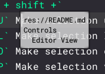

# 1.7
- Added option to view `Extensionless` files.
- Added Symbol path heirarchy to hint popup so you know where you are in big files:  
	
- `ctrl + shift +`
	- `U` Make selection uppercase.
	- `L` Make selection lowercase.
	- `O` Make selection capitalized.
	- `P` Make selection variable: `My text -> my_text`
- Select file shorctut:
	- `ctrl + shift + 0-9` Remember file.
	- `ctrl + 0-9` Swap to file.
- Selected Symbol is now highlighted.
- Improved meta data for `.md` files.
- `search` will autoselect term when clicked.
- `search` `all` toggle added to allow only searching in the selected file.
- `search` `case` toggle added to allow searching based on upper/lower case.
- `sys` panel shows unique word list.
- `sys` panel shows time since modified.
- Can create a `word_skip_list.txt` in main folder for ignoring certain words from showing in `sys` word list.
- File List panel hint paths are localized.
- Removed `.md` function color.
- Fixed `trash` not working in exported binaries.
- Fixed dragging files into directory bug.
- Fixed temporary files not closing properly.
- Fixed close non existing tab bug.
- Fixed symbol list not redrawing after file closed.
- Fixed symbol list not redrawing after file type changed. 
- Fixed focus not being grabbed when tab selected.

# 1.6
- Added `Uppercase` `Lowercase` and `Capitalize` option to popup menu for selected text.
- `ctrl + click` in Symbol View selects entire "chapter" and sub "chapters". `ctrl + shift + click` selects only one "chapter".
- `ctrl + click` in editor will auto scroll symbol view.
- Folders can be tinted.
- `word_wrap` state is saved/loaded.
- Fixed error that occured when folder containing binary was moved.
- Markdown can have a `progress` field in meta data which can be sorted in `sys`.
- Markdown meta info taken into account for `sys`
- Markdown meta info colourized.
- Markdown code color based on variable color.
- JSON comments like YAML: `"#": "comment"`
- JSON color tweaks.

# 1.5
- Added `Ctrl + N` to immediately create new file without defining path.
- New unsaved file will have contents remembered.
- Added `Ctrl + Shift + Mouse wheel` to change ui font size.
- Added word wrap toggle.
- Fixed sorting error in `sys`.
- Fixed font size save/load.
- `sys` shows chapter count.
- Preserves symbol view scroll value when tabbing.
- Can access full filesystem.
- Fixed "New File" dialog not gaining focus.

# 1.4
- Added `sys` info tab.
- Added `console` info tab. (wip)
- Changing extension updates colors.
- Fixed exported build not styling things properly.
- Fixed symbols/tags not showing when first booting editor.
- Tweaked colors.
- Internal rewriting.

# 1.3
- Basic search implemented. `Ctrl + F`
- Can create links inside `()` which makes markdown links clickable.: `Ctrl + Click`

# 1.2
- Can unrecycle now. (Make sure `view/Directories/.trash` is toggled, then press arrow.
- Added folder recycle option
- Added folder move/drag.
- Empty directories properly hide if they have no subdirectories.
- Fixed hide/show file type not updating list.
- Settings are saved more frequently.
- Fixed file dragging.
- Fixed meta table not resizing.
- Tweaked symbol colorizer to emphasize depth.
- Bug fixes.

# 1.1
- Added `addons` folder hider option.
- Preserve folder open/close state.
- Fixed directories with `.gdignore` not hiding.
- Fixed files and directories not being sorted.
- Fixed "failed to load settings" error.
- Tweaked syntax coloring.
- Got rid of accidental test file.