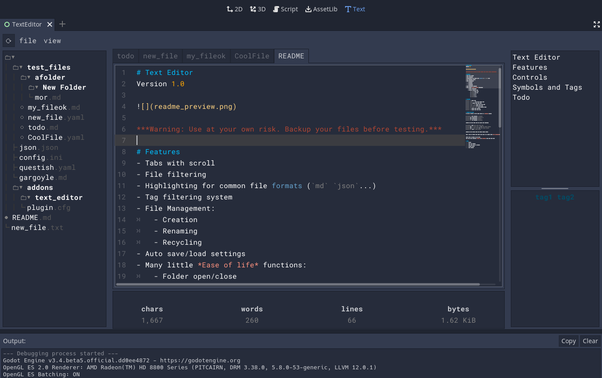

# Text Editor
Version `1.12`

***Warning: Use at your own risk. Backup your files before testing.***

# Features
- Multi file tab system.
- File browser filtering.
- Highlighting for common formats (`md` `json` `ini`...)
- Tag [System](#mini-features-tags).
- File Management:
	- Creation.
	- Renaming.
	- Recycling.
	- Moving.
- Search files.
- Image previews.
- Auto save/load settings.
- Many little *Ease of Life* [features](#mini-features).

# Controls
- `ctrl + N` New file.
- `ctrl + W` Close file.
- `ctrl + shift + W` Open last closed file .
- `ctrl + tab` Select next open file.
- `ctrl + shift + tab` Select last open file.
- `ctrl + mouse wheel` Adjust font size.
- `ctrl + shift + mouse wheel` Adjust ui font size.
- `ctrl + up` & `ctrl + down` Move selected lines.
- `ctrl + /` Toggle line comments.
- `ctrl + M` Toggle file meta info.
- `ctrl + F` Search for text in all files.
- `ctrl + shift + 0-9` Create hotkey for selected file.
- `ctrl + 0-9` Load hotkeyed file.

## Symbol View
- `ctrl + click` Select entire block + children.
- `ctrl + shift + click` Select block without children.

## Editor View
- `ctrl + click` anywhere: Scroll to nearest symbol in symbol view.
- `ctrl + click` inside brackets: Goto local file.
- `ctrl + shift +`
	- `U` Make selection uppercase.
	- `L` Make selection lowercase.
	- `O` Make selection capitalized.
	- `P` Make selection variable: `My text -> my_text`

# Symbols and Tags
*Symbols* are like *Table of Contents* for a file.

- `Markdown` uses headings `# Heading`
- `JSON` uses Dictionaries `"object": {`
- `YAML` uses Dictionaries `object: `
- `ini` `cfg` use headings `[heading]`

Symbols can have *Tags*. Tags are added with comments.

- `Markdown` uses `<!-- #tag1 #tag2 -->`
- `JSON` uses `"#": "#tag1 #tag2"`
- `YAML` uses `# #tag1 #tag2` or `"#": "#tag1 #tag2"`
- `ini` `cfg` uses `; #tag1 #tag2`

Symbols are per file, tags are shared across files.

When a file is opened with tags, they show up in bottom right *Tag Container*.

Click them to toggle on and off.\
This will then highlight *Files* and *Symbols* that have that tag.

# Todo
- [x] `1.1` Preserve folders open/close state.
- [x] `1.3` Search all files.
- [x] `1.7` Search file.
- [ ] Find and replace.
- [x] `1.7` Improve meta data based on format.
- [x] `1.2` Recycle folders.
- [x] `1.2` Unrecylce. (Toggle `view/directories/.trash` and press green arrow.)
- [ ] JSON formatting.
- [ ] JSON error testing.
- [ ] Color themes.

# Mini features

## File List
### Colorize Folder
You can colorize files in a folder for easier identification. Right click a folder and select a color.
The `tab colors` toggle at the top will toggle tabs colorized by folder.

### Content Preview
You can preview the contents of a file by `ctrl + click`ing it.

The list is clickable, so you can go straight to a section of the file.

When using the filter, contents will be scanned.

## Content List (Symbols)
### Selecting Sections
`ctrl + click`ing on a symbol will select all lines contained in it, and it's childrens.

`ctrl + shift + click` a symbol will only select it's lines, not it's childrens.

## File Editor
### Follow Link
You can follow Markdown links by `ctrl + click`ing on them.

## Tags
The tag list displays all tags throughout the files.

To add a tag to a file, include a comment, with a hashtag:
- `.md`: `<!-- #tag1 #tag2 -->`
- `.json`: `{ "#": "#tag1 #tag2 }`
- `.ini` `.cfg`: `; #tag1 #tag2`
- `.yaml`: `# #tag1 #tag2`

`click` a tag to select it.

All files in the File List and symbols in the Symbol List containing the tag, will be highlighted.

`ctrl + click` to select multiple tags at once.

## Meta Panel
Toggle the meta panel with `ctrl + M`.

### Meta
The meta tab updates whenever you make a save.

It lists some information on the contents of your file.

Currently it mostly only works for Markdown.

### Search
todo

### System
Hitting refrsh will list all files in a table with sortable columns.

Select a column to sort on:
- Chapter count.
- Word count.
- Unique words.
- Progress.
- Time since modified.

### Image
In Markdown files (`.md`) you can `ctrl + click` an image to preview it.

Images look like: `` in Markdown.

# Icon credit
<a href="https://www.flaticon.com/free-icons/files-and-folders" title="files and folders icons">Files and folders icons created by Uniconlabs - Flaticon</a>